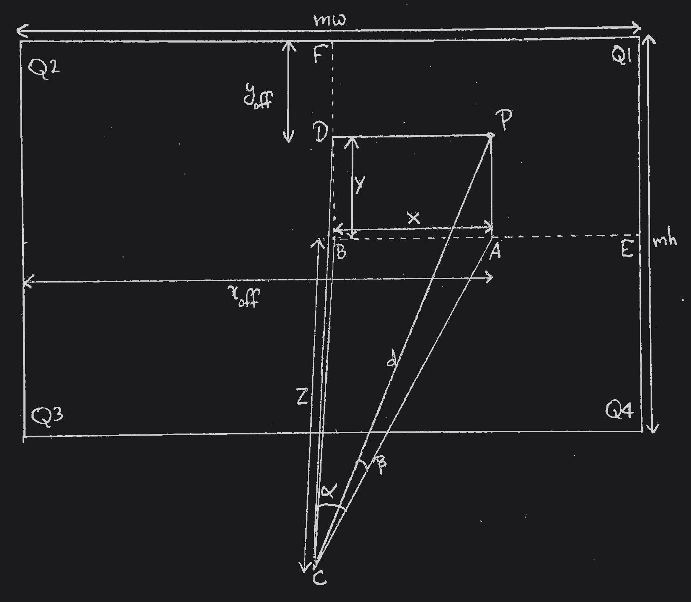
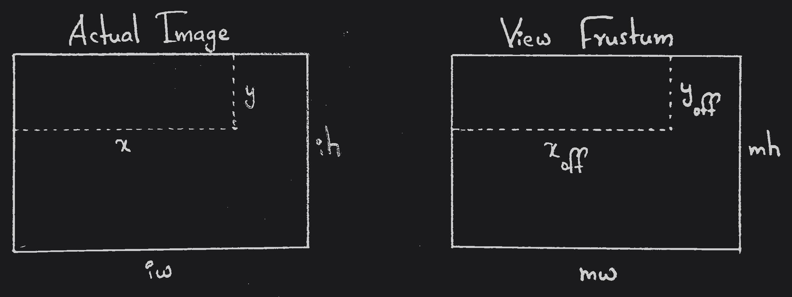
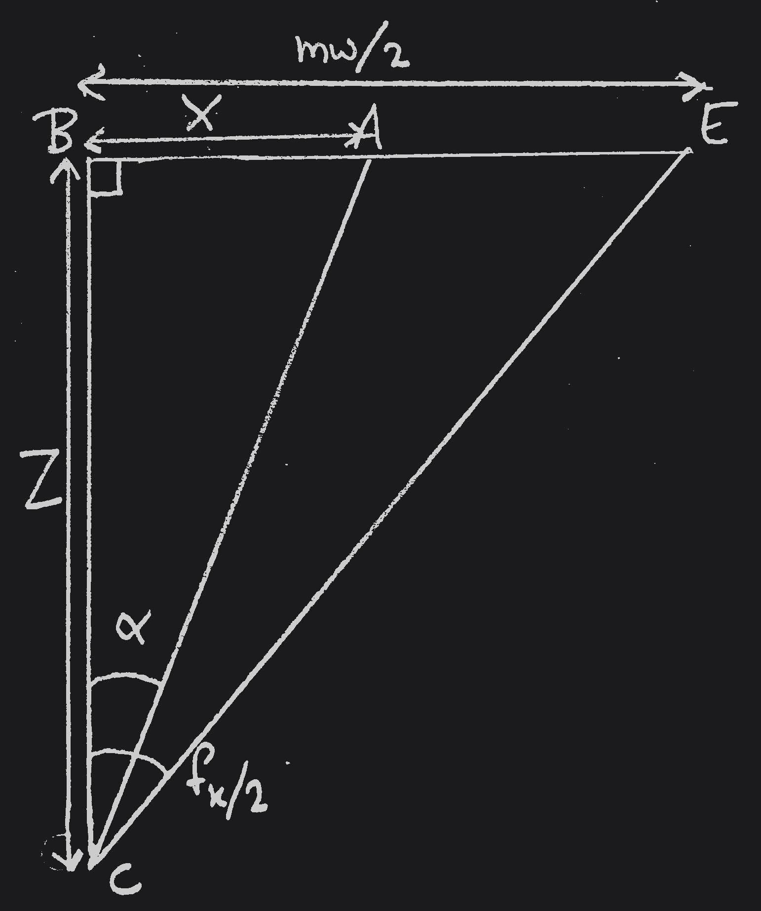
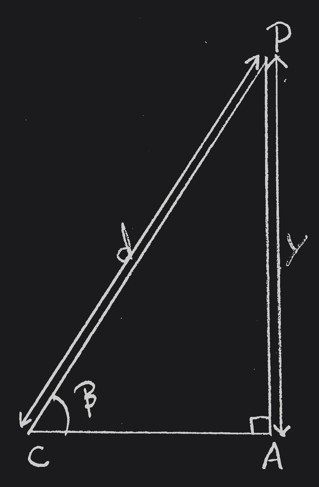

## Problem Statement

I was assigned a task to plot the trajectory of objects and humans from a CCTV footage (lacking metadata such as depth and extrinsic parameters) to a 3D model. To explain the problem statement better, consider a scenario where you are watching a cricket match and the batsman hit a 6. The shot will be replayed multiple times from different angles. In one of the replays, you will be shown a 3D model of the cricket stadium and trajectory of the ball with no additional elements like audience, players etc. That is what I was asked to recreate but in terms of CCTV and objects visible in the footage. Here the objects may refer to people, animals, any moving targets etc. Although this approach is used in many areas, it was never open-sourced. So, I solved the problem and sharing the same here.

Plotting the trajectory of the cricket ball is quite easy compared to the problem statement because we need only the parabolic equation which can be formed by the parameters like time of flight, starting position, final position etc which we can calculate easily. But tracking an object whose trajectory is dynamic, is a bit challenging that too with a camera lacking depth and motion sensors. To address this problem, there are many open-source libraries like YOLO for object detection and BoT-SORT or ByteTrack for object tracking. But they only work in the 2-dimensional space and we need to plot them in 3-dimensional space.

## My Approach

Since the camera position is static, we can solve it for an image and later we can extend it to video. At a high-level overview, my approach boils down to the following 5 steps:

1. Detect and track an object using [YOLO](https://docs.ultralytics.com/models/yolo12/).
2. Extract the 2D coordinates (pixel values) of the point in the region of interest of the object.
3. Estimate the depth at the location using [Apple's Depth-Pro](https://github.com/apple/ml-depth-pro).
4. Find out the camera's intrinsic and extrinsic parameters. (Camera Calibration)
5. Convert the 2D coordinates into 3D coordinates according to the real-world coordinate axes. (My main focus)
    * Traditional Way (TW)
    * My Way (MW)

## Preliminary Steps

The first 4 out of 5 steps are not trivial but the complexity of those problems have been mitigated by the abstract layers provided by the open-source libraries mentioned above. Although I am going to explain the last step in a very detailed manner, I provide the brief explanation of those 4 steps below.

### Object Detection and Tracking

I recommend [YOLO12](https://docs.ultralytics.com/models/yolo12/) for this task since it is the current state-of-the-art model. It performs both detection and tracking out of the box for multiple objects in the scene. For tracking, they provide 2 options: BoT-SORT and ByteTrack. Visit [this page](https://docs.ultralytics.com/modes/track/) for more details on trackers.

Surprisingly, LLMs like ChatGPT and Gemini generate pretty accurate and error-free code for this task especially using YOLO. I guess many people used YOLO in their public repositories in GitHub from which the LLMs scraped the code.

### Extraction of 2D Coordinates of the Objects

After performing the above step, you will get 2 2D coordinates $[(x_1, y_1), (x_3,y_3)]$ for each object detected. The points belong to any 2 opposite corners of the bounding box rectangles. Since we need a single point to denote the object, we can calculate the midpoint of the rectangle. But it is not necessary to be the midpoint always. It can be any point inside the region of interest of the object as long as the point is detectable by some model in step 1. For this problem, I am sticking with the centroid.

The formulae to calculate the centroid $(C_x, C_y)$ of a rectangle formed by points $[(x_1, y_1), (x_2, y_2), (x_3, y_3), (x_4, y_4)]$ are given by:

$$C_x = \frac{x_1+x_2+x_3+x_4}{4}$$
$$C_y = \frac{y_1+y_2+y_3+y_4}{4}$$

Since the edges of the bounding box rectangle are parallel with the $XY$ coordinate axes, you will be needing only any 2 opposite points from the rectangle. Then the formulae can be minimized to:

$$C_x = \frac{x_1+x_3}{2}$$
$$C_y = \frac{y_1+y_3}{2}$$

### Depth Estimation

Depth Estimation can be classified either as Absolute (Metric) or Relative. Absolute Depth Maps provide the distance of each point measured from the camera. Whereas the Relative Depth Maps provide only the distances between the objects in the scene (unrelated to the camera's position). So, we need Absolute Depth Maps in order to solve our problem.

I recommend [Apple's Depth-Pro](https://github.com/apple/ml-depth-pro) for this task since it is the current state-of-the-art model. It performs absolute depth estimation and provides the output in meters. To access the depth of a point $(x, y)$, use `depth[y, x]`.

### Camera Calibration

The process of determining a camera's internal (intrinsics) and external (extrinsics) parameters is known as Camera Calibration. Camera's Intrinsics include Focal Length, Resolution and Distortion Parameters. Camera's Extrinsics include Translation and Rotation of the camera's coordinate axes with respect to the real world coordinate axes. Both Intrinsics and Extrinsics are represented using matrices. Together, it is known as Camera Matrix `P`.

$$
\begin{aligned}
P \&= \overbrace{K}^\text{Intrinsic Matrix} \times \overbrace{[R \mid  \mathbf{t}]}^\text{Extrinsic Matrix} \\\\
& \\\\
&= \overbrace{
\underbrace{
\left (
\begin{array}{ c c c}
1  &  0  & x_0 \\\\
0  &  1  & y_0 \\\\
0  &  0  & 1
\end{array}
\right )
}\_{\text{2D Translation}}
\times
\underbrace{
\left (
\begin{array}{ c c c}
f_x &  0  & 0 \\\\
0  & f_y & 0 \\\\
0  &  0  & 1
\end{array}
\right )
}\_{\text{2D Scaling}}
\times
\underbrace{
\left (
\begin{array}{ c c c}
1  &  s/f_x  & 0 \\\\
0  &    1    & 0 \\\\
0  &    0    & 1
\end{array}
\right )
}\_{\text{2D Shear}}
}^\text{Intrinsic Matrix}
\times
\overbrace{
\underbrace{
\left( \begin{array}{c | c}
I & \mathbf{t}
\end{array}\right)
}\_{\text{3D Translation}}
\times
\underbrace{
\left( \begin{array}{c | c}
R & 0 \\\\ \hline
0 & 1
\end{array}\right)
}\_{\text{3D Rotation}}
}^\text{Extrinsic Matrix}
\end{aligned}
$$

A very detailed explanation for the matrix is provided in these blogs: [Part 1](https://ksimek.github.io/2012/08/14/decompose/), [Part 2](https://ksimek.github.io/2012/08/22/extrinsic/) and [Part 3](https://ksimek.github.io/2013/08/13/intrinsic/).

Considering distortion parameters can be optional if your goal does not need highly accurate coordinates. Excluding that, obtaining intrinsics is rather easy compared to extrinsics. To make our lives easier, there is an open-source library [Intel's Open3D](https://www.open3d.org/). Open your 3D model in Open3D and look the scene from the perspective of your camera's estimated position. Depending on your choice in the next step, you can perform the respective step now:
* TW: Press `p` to capture both the screen and camera's intrinsic-extrinsic matrices as `png` and `json` files respectively.
* MW: Press `Ctrl + c` to save the `json` to the clipboard.

Visit [this page](https://www.open3d.org/docs/release/tutorial/visualization/visualization.html) for more details and guidance. Note that the formats of the `json` files in TW and MW are different.

## Conversion of 2D to 3D Coordinates

### Traditional Way

This approach is very well explained in [OpenCV documentation](https://docs.opencv.org/4.x/d9/d0c/group__calib3d.html) and [Ksimek blogs](https://ksimek.github.io/2012/08/13/introduction/). I chose not to follow this approach because I however need to find the lost dimension (depth) separately and plug it in the final formula. So, I decided to rederive the whole approach using simple geometry and trigonometry, to have a complete understanding of the process behind the scenes.

### My Way

Before I derive the formulae, take a look at the parameters that we already know:

| Parameter | Description | Obtained In |
|:-:|:-:|:-:|
| $x$ | X-coordinate of the object in the image (in pixels) | Step 2 |
| $y$ | Y-coordinate of the object in the image (in pixels) | Step 2 |
| $iw$ | Image width (in pixels) | Step 4 |
| $ih$ | Image height (in pixels) | Step 4 |
| $f_x$ | Horizontal Field of View (in degrees) | Step 4 |
| $d$ | Depth of the object from the camera (in meters) | Step 3 |
| $u$ | Up vector | Step 4 |
| $f$ | Forward vector | Step 4 |
| $c$ | Camera position in real world coordinates | Step 4 |

Obtaining accurate $u$, $f$ and $c$ vectors solely depend on how well you can calibrate the view in the 3D software. Before you arrange the position and orientation, set up the focal length. If you have captured the image using your mobile phone and wants to know its horizontal FOV, you can use apps which show device specs. And remember to look for the horizontal FOV, not the vertical FOV or the diagonal FOV.

We need to find the 3D coordinates of the object in the real world coordinate system. But we first need to find the coordinates in the camera's coordinate system and then we can transform them to the real world coordinate system. Let the coordinates in the camera's coordinate system be $(X, Y, Z)$.

#### Derivation

If we divide the rectangular image into 4 quadrants, Q1, Q2, Q3 and Q4, then the formuale will slightly differ for each quadrant. Let us derive them for the first quadrant (Q1) where $x > iw/2$ and $y < ih/2$. The other quadrants can be derived in a similar manner. The view frustum of the camera in Q1 can be visualized as shown below:



Here is a comparison between the actual image and the view frustum of the camera:



Here, $x_{off}$ and $y_{off}$ are the offsets of the object from the center of the image. $mw$ and $mh$ are maximum width and maximum height of the view frustum at the depth of the object respectively (that focal length of the camera allows). From this, we can formulate the following relationships:

$$\frac{x}{y} = \frac{x_{off}}{y_{off}}$$
$$\frac{x}{iw} = \frac{x_{off}}{mw}$$
$$\frac{y}{ih} = \frac{y_{off}}{mh}$$


{width="300" .w-50 .right}

In $\triangle CBE$,

$$\begin{aligned}
\tan \left( \frac{f_x}{2} \right) &= \frac{mw}{2} \times \frac{1}{Z} \\\\
& \\\\
\implies Z &= \frac{mw}{2\tan (f_x/2)}
\end{aligned}$$

In $\triangle CBA$,

$$\begin{aligned}
\tan \alpha &= \frac{X}{Z} \\\\
& \\\\
&= \frac{x_{off}-(mw/2)}{Z} \\\\
& \\\\
&= \frac{2x_{off}-mw}{\cancel{2}} \times \frac{\cancel{2} \tan(f_x/2)}{Z}\\\\
& \\\\
&= \tan(f_x/2) \times \left( \frac{2x_{off}}{mw} - 1 \right) \\\\
& \\\\
&= \tan(f_x/2) \times \left( \frac{2x}{iw} - 1 \right) \\\\
& \\\\
\therefore \alpha &= \arctan \left( \tan(f_x/2) \times \left( \frac{2x}{iw} - 1 \right) \right)
\end{aligned}$$

In the same triangle,

$$\begin{aligned}
\sin \alpha &= \frac{X}{AC} \\\\
& \\\\
\implies AC &= \frac{X}{\sin \alpha} \\\\
\end{aligned}$$


{width="200" .w-50 .right}

In $\triangle CAP$,

$$\begin{aligned}
\tan \beta &= \frac{Y}{AC} \\\\
& \\\\
&= ((mh/2)-y_{off}) \times \frac{\sin \alpha}{x_{off}-(mw/2)} \\\\
& \\\\
&= \frac{(mh/2)-y_{off}}{x_{off}-(mw/2)} \times \sin \alpha \\\\
& \\\\
&= \frac{mh-2y_{off}}{2x_{off}-mw} \times \sin \alpha \\\\
& \\\\
&= \frac{(y_{off} \times (ih/y))-2y_{off}}{2x_{off}-(x_{off} \times (iw/x))} \times \sin \alpha \\\\
& \\\\
&= \frac{y_{off} \times ((ih/y)-2)}{x_{off} \times (2- (iw/x))} \times \sin \alpha \\\\
& \\\\
&= \frac{y \times ((ih/y)-2)}{x \times (2- (iw/x))} \times \sin \alpha \\\\
& \\\\
&= \frac{ih-2y}{2x-iw} \times \sin \alpha \\\\
& \\\\
\therefore \beta &= \arctan \left( \frac{ih-2y}{2x-iw} \times \sin \alpha \right)
\end{aligned}$$

In the same triangle,

$$\begin{aligned}
\cos \beta &= \frac{X}{\sin \alpha \times d} \\\\
& \\\\
\therefore X &= d \times \cos \beta \times \sin \alpha\\\\
& \\\\
\therefore Y &= d \times \sin \beta \\\\
& \\\\
\therefore Z &= X/\tan \alpha
\end{aligned}$$

Now we have the coordinates of the object in the camera's coordinate system. We can transform them to the real world coordinate system using $u$, $f$, $c$ vectors. Let the final vector of the object in the real world coordinate system be $\vec{P}$.

$$\vec{P} = \vec{c} + X (\vec{u} \times \vec{f}) + Y \vec{u} - Z \vec{f}$$

This formulae is for Q1. We can similarly derive for the other quadrants also. Below is the python code combining all the quadrants together.

#### Python Code

```python
import numpy as np

def get_quadrant(x, y, iw, ih):
    xdir = 'Positive' if x >= iw / 2 else 'Negative'
    ydir = 'Positive' if y >= ih / 2 else 'Negative'
    if xdir == 'Positive' and ydir == 'Positive':
        quadrant = 4
    elif xdir == 'Negative' and ydir == 'Positive':
        quadrant = 3
    elif xdir == 'Negative' and ydir == 'Negative':
        quadrant = 2
    else:
        quadrant = 1
    return quadrant

def get_xyz(x, y, iw, ih, fx, d, u, f, c, scale=1):
    fx = np.deg2rad(fx)
    quadrant = get_quadrant(x, y, iw, ih)
    if quadrant == 1:
        alpha = np.arctan(np.tan(fx/2) * (2*x/iw-1))
        beta = np.arctan((ih-2*y)*np.sin(alpha)/(2*x-iw))
    elif quadrant == 2:
        alpha = np.arctan(np.tan(fx/2) * (1-2*x/iw))
        beta = np.arctan((ih-2*y)*np.sin(alpha)/(iw-2*x))
    elif quadrant == 3:
        alpha = np.arctan(np.tan(fx/2) * (1-2*x/iw))
        beta = np.arctan((2*y-ih)*np.sin(alpha)/(iw-2*x))
    else:
        alpha = np.arctan(np.tan(fx/2) * (2*x/iw-1))
        beta = np.arctan((2*y-ih)*np.sin(alpha)/(2*x-iw))
    X = d * np.cos(beta) * np.sin(alpha)
    Y = d * np.sin(beta)
    Z = X / np.tan(alpha)
    o = -Z * f
    if quadrant == 2 or quadrant == 3:
        o -= X * np.cross(u, f)
    else:
        o += X * np.cross(u, f)
    if quadrant == 1 or quadrant == 2:
        o += Y * u
    else:
        o -= Y * u
    p = c + scale * o
    return p

# x, y, iw, ih, fx, d = 1000, 300, 1920, 1080, 70, 10
# u = np.array([0, 1, 0])
# f = np.array([0, 0, 1])
# c = np.array([0, 0, 0])
# get_xyz(x, y, iw, ih, fx, d, u, f, c)
```
